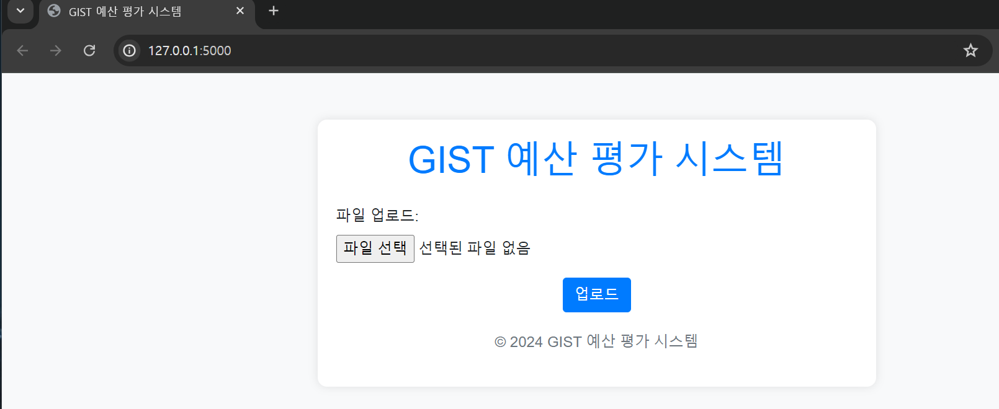
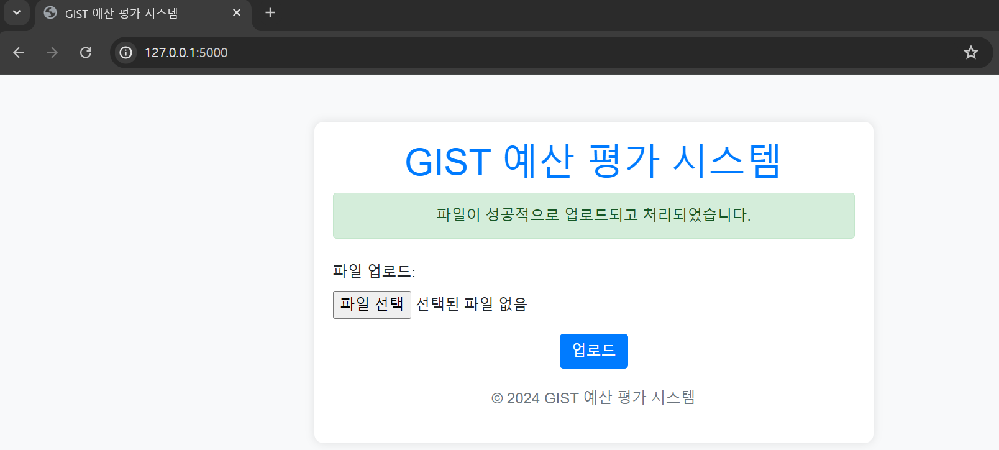
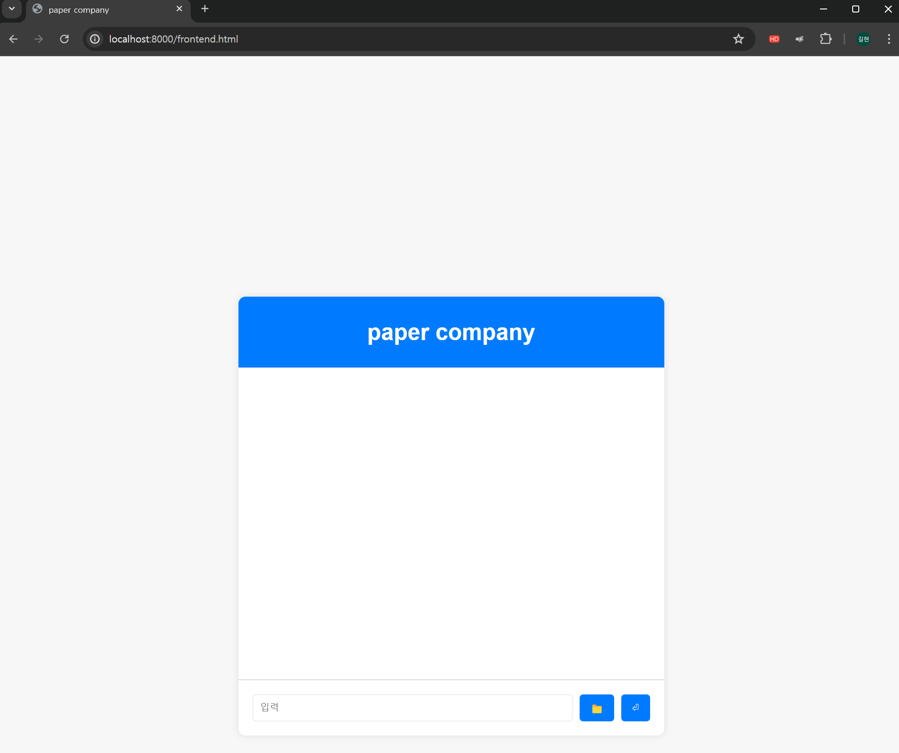

# S24_PBL1
PBL 6조

File description
================
GUI: 폴더 내부의 GUI.py 파일을 실행시키면 PyQt5로 구현된 GUI를 확인할 수 있습니다.

web_chat: backend.py 파일을 실행하면, 웹상에서 채팅 봇을 구현한 것을 확인할 수 있습니다.

web_frontend: app.py 파일을 실행하면 저희의 서류 피드백 기능을 프론트 엔드로 구현한 웹을 확인할 수 있습니다. 하지만 기능이 제대로 구현이 되어있지 않습니다.

Frontend Examples
=================

</img>

이것이 frontend로 구현한 서류 피드백 시스템의 데모입니다. 여기서 업로드 버튼을 선택하면 피드백을 원하는 서류를 업로드 할 수 있습니다.

</img>

위와 같이 파일 업로드를 진행하면 알림이 뜨게 됩니다.

Further development
==
저희의 목표는 단순한 서류 피드백 시스템에서 벗어나서, 피드백을 받고 궁금한 점이 있으면 대화를 통해서 추가적인 정보도 얻을수 있는 서류 피드백 특화 챗봇 기능의 구현입니다.

</img>
